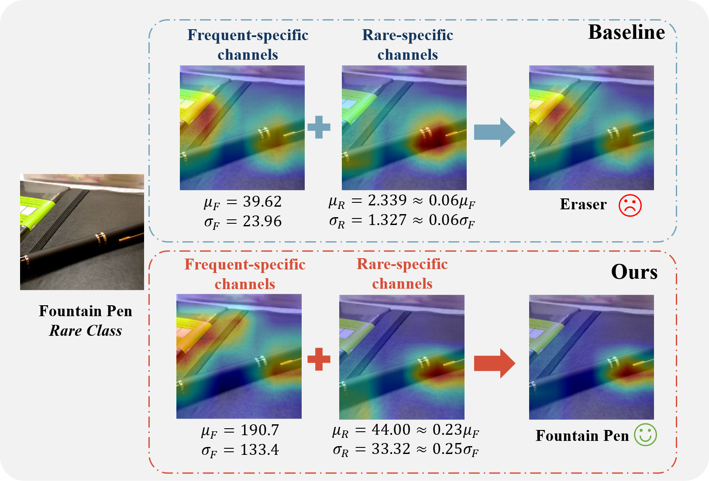

# Normalizing Batch Normalization for Long-Tailed Recognition

<font size=7><div align='center' >
[](https://github.com/yuxiangbao/NBN)
[](https://arxiv.org/pdf/2501.03122)
</div></font>

<div align=center>

</div>

## 🎯 Snapshot

```python
class BatchNorm2d(nn.BatchNorm2d):        
    def scale(self, alpha):
        self.w = self.weight / (torch.norm(self.weight)+1e-6) * alpha
        if self.bias is not None:
            self.b = self.bias / (torch.norm(self.bias)+1e-6) * alpha
        else:
            self.b = self.bias
            
    def forward(self, input):
        self._check_input_dim(input)
        w = self.w if hasattr(self, 'w') else self.weight
        b = self.b if hasattr(self, 'b') else self.bias
        x = F.batch_norm(
            input,
            self.running_mean
            if not self.training or self.track_running_stats
            else None,
            self.running_var if not self.training or self.track_running_stats else None,
            w,
            b,
            bn_training,
            exponential_average_factor,
            self.eps,
        )
        return x
```

## 🛠️ Installation
```shell
pip install -r requirements.txt
```

## 🚀 Training and Validation

### 1. Training Data Preparation

Before training, please download the datasets following [Kang](https://github.com/facebookresearch/classifier-balancing). Then, update the `data_root` parameter in the YAML configuration files found in the `./config` directory.

### 2. Training

We provide the [launch.sh](./launch.sh) script to initiate the training process. This script supports both single-GPU and multi-GPU training using FP32 and FP16 precision modes. For multi-GPU setups, it supports both Data Parallel (DP) and Distributed Data Parallel (DDP).
```shell
# training with single gpu
python main.py /path/to/config --gpu $gpu_id --amp

# training with data parallel
python main.py /path/to/config --amp

# training with distributed data parallel
python main.py /path/to/config -d --world-size 1 --rank 0 --amp
```

### 3. Validation

Likewise, the code also support single-gpu and multi-gpu validation. For multi-GPU validation, we use Distributed Data Parallel (DDP) as an example.

```shell
python main.py /path/to/config -d --world-size 1 --rank 0 --amp -e --pretrain /path/to/checkpoints
```

The checkpoints can be freely downloaded from [Google Drive](https://drive.google.com/file/d/1ebEgsvbp00AvKcfa2JQRK8rVoQ6Ab38C/view?usp=sharing) or [Baidu Pan](https://pan.baidu.com/s/1feTkJ6h3HUG24lehOr9BUw?pwd=6fdv).


## ⭐ Cite

If you find this project useful in your research, we appreciate your star and citation of our work:

```
@article{bao2024normalizing,
  title={Normalizing Batch Normalization for Long-Tailed Recognition},
  author={Bao, Yuxiang and Kang, Guoliang and Yang, Linlin and Duan, Xiaoyue and Zhao, Bo and Zhang, Baochang},
  journal={IEEE Transactions on Image Processing},
  year={2024},
  publisher={IEEE}
}
```

## 🎖️ Acknowledgement
This work is built upon the [decoupling cRT](https://github.com/facebookresearch/classifier-balancing), [Balanced Softmax](https://github.com/jiawei-ren/BalancedMetaSoftmax-Classification), [RoBal](https://github.com/wutong16/Adversarial_Long-Tail), and [supsup](https://github.com/RAIVNLab/supsup).

## 🦄 Contact
Please contact [@yuxiangbao](https://github.com/yuxiangbao) for questions, comments and reporting bugs.